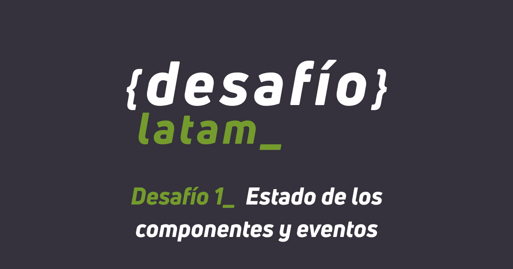

# Solución al Desafío "Estado de los componentes y eventos"

## Academia Desafío Latam | Bootcamp Fullstack con JavaScript - G41

### Trabajo colaborativo

Forkeé y envié pull requests a los repositorios de los siguientes compañeros:

- [Carlos Silva Diaz](https://github.com/darjnest/formulario)
- [Javier Figueroa](https://github.com/javiernfigueroa/desafio-react-2)
- [Pedro Salinas Silva](https://github.com/pesalinassilva/formulario-validacion)

Recibí y acepté las pull requests de los siguientes compañeros:

- [Renato Francisco Báez Lobos](https://github.com/renatobaez/estado-componentes-y-eventos)
- [Pedro Salinas Silva](https://github.com/pesalinassilva/formulario-validacion)